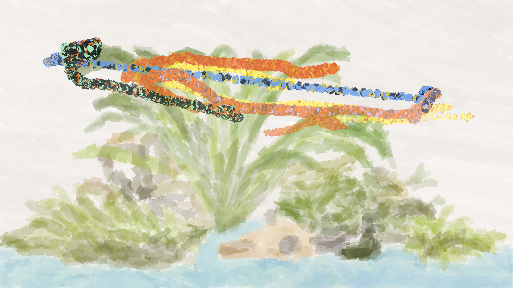

After seeing a rat "paint" by running across a canvas with paint on its feet, I wanted a way to let my guppies "paint." Covering them in paint would not end well, so I made this program to track their motion and map it to a digital paintbrush.

I made this using YOLOv11 to identify individual fish and track their motion across video frames. With a list of coordinates for each guppy, the code filters out misidentifications by removing points where the guppy appears to jump to another spot in the tank. Gaps in the guppy's path, such as when it is occluded by a leaf, are compensated for by filling in points between the last known coordinates. Each guppy gets its own paintbrush color, eyedropped from a photo of the fish.



This approach worked fine at first, but all of the guppies I trained the YOLO model on have since passed away, which revealed a glaring failure mode. Retraining the model every time I get a new fish isn't practical, so my next goal is to implement Re-ID. An object recognition model trained to recognize fish, combined with Re-ID, should make this program work for any fish.  

## Usage

The pipeline has four stages so that detection, background generation, track-cleaning experiments, and painting settings can be run independently.
Use Python 3.9 or newer and install the dependencies with `pip install -r requirements.txt`.

```bash
python src/extract_points.py \
  --video videos/test_clip.mp4 \
  --model src/best.pt \
  --output data/points/test_clip_raw.json

python src/create_background.py \
  --video videos/test_clip.mp4 \
  --detections data/points/test_clip_raw.json \
  --output paintings/test_clip_background.png \
  --seed 42

python src/clean_points.py \
  --input data/points/test_clip_raw.json \
  --output data/points/test_clip_cleaned.json \
  --max-jump-per-frame 30 \
  --max-gap-frames 50

python src/create_painting.py \
  --tracks data/points/test_clip_cleaned.json \
  --background paintings/test_clip_background.png \
  --fish-ids 2 \
  --output paintings/
```

Background generation uses the video's midpoint frame. It masks fish using the raw detection boxes, fills those regions from surrounding pixels, and renders the repaired frame with coarse-to-fine brush marks. Do not filter `extract_points.py` with `--fish-ids` when generating a background; the raw JSON needs detections for every fish in the frame. Pass `--background path/to/background.png` when rendering to paint over an image; otherwise, the renderer uses a white canvas. Run any script with `--help` to see its remaining settings.

## TO DO:

- [x] reorganize repo (move beyond notebook)
- [x] make canvas automatically from video
- [ ] implement Kalman Filter for point interpolation
- [ ] learn about Re-ID
- [ ] implement Re-ID (Note: YOLO26 seems to support it, but coding from scratch will be better for learning)
