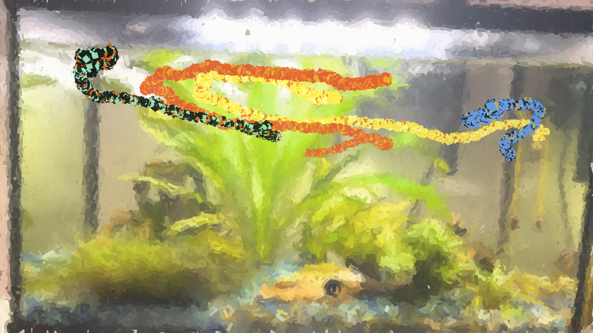

## Fish Painting

After seeing a rat "paint" by running across a canvas with paint on its feet, I wanted a way to let my guppies "paint." Covering them in paint would not end well, so I made this program to track their motion and map it to a digital paintbrush.

I made this using YOLOv11 to identify individual fish and track their motion across video frames. With a list of coordinates for each guppy, the code filters out misidentifications by removing points where the guppy appears to jump to another spot in the tank. Gaps in the guppy's path, such as when it is occluded by a leaf, are compensated for by filling in points between the last known coordinates. Each guppy gets its own paintbrush color, eyedropped from a photo of the fish.



This approach worked fine at first, but all of the guppies I trained the YOLO model on have since passed away, which revealed a failure mode. Retraining the model every time I get a new fish isn't practical, so my next goal is to implement Re-ID. An object recognition model trained to recognize fish, combined with Re-ID, should make this program work for any fish.  

## Usage

The pipeline has four stages so that detection, background generation, track-cleaning experiments, and painting settings can be run independently.
Use Python 3.9 or newer and install the dependencies with `pip install -r requirements.txt`.

To run the entire pipeline and save only the final painting:

```bash
python src/run_pipeline.py \
  --video data/videos/test_clip.mp4 \
  --model src/best.pt \
  --fish-ids 0 1
```

This writes `paintings/fish_art_<datetime>.png` by default. Use `--output` to choose a different final path or directory. Raw detections, cleaned points, and the generated background remain in memory and are not saved.

To run or inspect each stage separately:

```bash
python src/extract_points.py \
  --video data/videos/test_clip.mp4 \
  --model src/best.pt

python src/create_background.py \
  --input data/videos/test_clip.mp4 \
  --detections data/points/raw/test_clip.json \
  --seed 0

python src/clean_points.py \
  --input data/points/raw/test_clip.json \
  --max-jump-per-frame 30 \
  --max-gap-frames 50

python src/create_painting.py \
  --tracks data/points/cleaned/test_clip.json \
  --background paintings/backgrounds/test_clip.png \
  --fish-ids 0 1 \
  --output paintings/
```

By default, each stage keeps the input filename and writes to its corresponding output directory. Pass `--output` to override the generated path. Background generation accepts either a still image or a video. For video input, it uses the midpoint frame by default and can mask fish using raw detection boxes. For a still image, pass a YOLO model to detect and remove fish: `python src/create_background.py --input photo.jpg --model src/best.pt`. Detected regions are filled from surrounding pixels before the repaired image is rendered with coarse-to-fine brush marks. Do not filter `extract_points.py` with `--fish-ids` when generating a video background; the raw JSON needs detections for every fish in the frame. Pass `--background path/to/background.png` when rendering to paint over an image; otherwise, the renderer uses a white canvas. Run any script with `--help` to see its remaining settings.

## Current Limitations and Planned Improvements:

- [ ] implement Kalman Filter for smoother point interpolation
- [ ] implement Re-ID to replace individual detection (Note: YOLO26 seems to support it, but coding from scratch will be better for learning)
